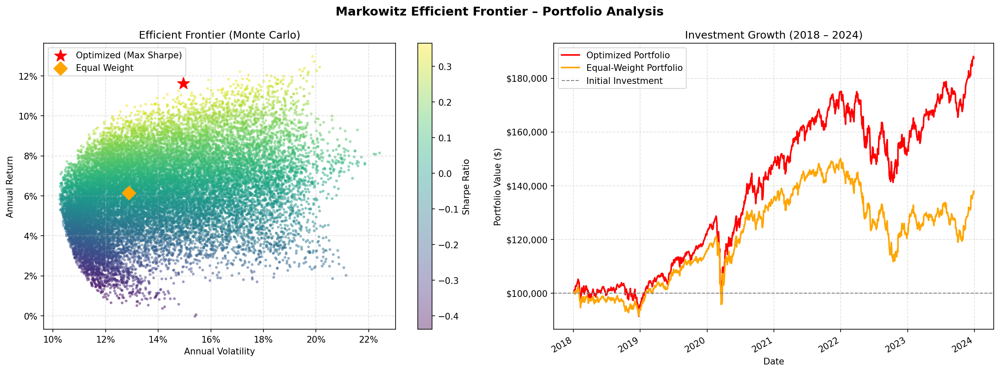

# Markowitz Efficient Frontier Portfolio Optimizer

A Python tool that builds an optimized stock portfolio using Modern Portfolio Theory. Given a set of ticker symbols and an investment amount, it finds the allocation that maximizes risk-adjusted returns, compares it against an equal-weight baseline, and visualizes both the efficient frontier and historical growth.

---

## Quick Start

```bash
pip install -r requirements.txt
python portfolio_optimizer.py
```

You will be prompted to enter your investment amount, number of assets, and ticker symbols. That's it.

---

## How It Works

### 1. Data Collection

The program fetches daily adjusted closing prices from Yahoo Finance via `yfinance` for a fixed window of **2018-01-01 to 2024-01-01**. Any rows with missing values are dropped before any calculations are performed.

---

### 2. Computing Portfolio Statistics

From the cleaned price data, three core quantities are derived:

- **Daily returns** — the percentage change in price from one day to the next.
- **Annualized expected return** — the mean daily return scaled by 252 (trading days per year).
- **Annualized covariance matrix** — the covariance of daily returns across all assets, also scaled by 252. This captures how assets move relative to each other, which is central to diversification.

---

### 3. Portfolio Optimization (Maximum Sharpe Ratio)

The optimizer uses `scipy.optimize.minimize` with the **SLSQP** method to find the set of portfolio weights that maximizes the **Sharpe Ratio**:

$$\text{Sharpe} = \frac{R_p - R_f}{\sigma_p}$$

Where $R_p$ is the portfolio return, $R_f$ is the risk-free rate (fixed at **6%**), and $\sigma_p$ is the portfolio volatility.

Two constraints are enforced:
- **No short selling** — all weights are between 0 and 1.
- **Fully invested** — weights must sum to exactly 1.

The optimizer starts from an equal-weight guess and converges on the weight vector that produces the highest Sharpe Ratio.

---

### 4. Risk Metrics

Three risk metrics are calculated for both portfolios:

**Sharpe Ratio** — excess return per unit of total risk. Higher is better.

**Sortino Ratio** — similar to Sharpe, but only penalizes *downside* volatility (days with negative returns). This makes it a more investor-friendly measure of risk.

$$\text{Sortino} = \frac{R_p - R_f}{\sigma_{\text{downside}}}$$

**95% Historical Value at Risk (VaR)** — the daily loss threshold that was exceeded only 5% of the time historically. For example, a VaR of -2% means there is a 5% chance of losing more than 2% in a single day.

---

### 5. Portfolio Comparison

The tool compares two portfolios side by side:

| Metric | Optimized Portfolio | Equal-Weight Portfolio |
|---|---|---|
| Weights | Solver-determined | 1/N for each asset |
| Expected Return | ✓ | ✓ |
| Volatility | ✓ | ✓ |
| Sharpe Ratio | ✓ | ✓ |
| Sortino Ratio | ✓ | ✓ |
| 95% VaR | ✓ | ✓ |

The equal-weight portfolio serves as a naive benchmark — it requires no optimization and is what you'd get from spreading capital evenly across all assets.

---

### 6. Monte Carlo Simulation

To map out the **Efficient Frontier**, the program generates **20,000 random portfolios** by sampling weight vectors from a Dirichlet distribution (which naturally ensures weights are non-negative and sum to 1). For each simulated portfolio, it computes return, volatility, and Sharpe Ratio. These points collectively trace the shape of the opportunity set — showing which combinations of assets are achievable and where the efficient frontier lies.

---

### 7. Investment Growth Simulation

Using the historical daily returns, the program simulates how your initial investment would have grown from 2018 to 2024 under each strategy:

1. Compute daily portfolio return as the weighted sum of individual asset returns.
2. Calculate the cumulative product of `(1 + daily_return)`.
3. Multiply by the initial investment to get portfolio value over time.

This gives a realistic, historically-grounded picture of how each strategy performed.

---

## Example

**Markowitz Efficient Frontier Portfolio Optimizer**


Enter initial investment amount ($): 100000
Enter number of assets: 5
  Enter ticker 1: AAPL
  Enter ticker 2: XOM
  Enter ticker 3: JNJ
  Enter ticker 4: PG
  Enter ticker 5: DUK

Downloading data for ['AAPL', 'XOM', 'JNJ', 'PG', 'DUK'] …
Data ready: 1509 trading days, 5 assets.


  **PORTFOLIO COMPARISON**

  **Optimized Portfolio (Max Sharpe)**

  AAPL    :  99.37%
  XOM     :   0.00%
  JNJ     :   0.00%
  PG      :   0.63%
  DUK     :   0.00%
  Expected Annual Return : 30.88%
  Annual Volatility      : 31.53%
  Sharpe Ratio           : 0.7889
  Sortino Ratio          : 1.0924
  95% Historical VaR     : -3.06%  (daily)


  **Equal-Weight Portfolio**

  AAPL    :  20.00%
  XOM     :  20.00%
  JNJ     :  20.00%
  PG      :  20.00%
  DUK     :  20.00%
  Expected Annual Return : 14.61%
  Annual Volatility      : 18.39%
  Sharpe Ratio           : 0.4678
  Sortino Ratio          : 0.5846
  95% Historical VaR     : -1.57%  (daily)

Running 20,000 Monte Carlo simulations...

**FINAL INVESTMENT VALUES**
Initial Investment      : \$100,000.00
Optimized Portfolio     : \$470,849.05  (370.8%)
Equal-Weight Portfolio  : \$216,525.53  (116.5%)


### Efficient Frontier and Investment Growth



The scatter plot shows all 20,000 simulated portfolios. Each point is colored by its Sharpe Ratio (brighter = better risk-adjusted return). The **optimized portfolio** (★) and **equal-weight portfolio** (◆) are highlighted. The upper-left boundary of the cloud is the efficient frontier — portfolios with the highest return for a given level of risk.

The chart on the right shows the dollar value of the initial investment over the 2018–2024 period for both strategies. The horizontal dashed line marks the starting value. The gap between the two lines illustrates the real-world impact of optimized allocation vs. naive equal-weighting.

---

## Assumptions & Limitations

- **Risk-free rate** is fixed at 6% annually and does not vary over time.
- **No transaction costs** or taxes are modeled.
- **No rebalancing** — weights are set once at the start and held through the entire period.
- The model assumes **returns are approximately normally distributed**, which may underestimate tail risk in practice.
- Results are based on **historical data** and do not guarantee future performance.

---

## Dependencies

```
numpy
pandas
yfinance
matplotlib
scipy
```

---

## License

MIT License

Copyright (c) 2026 Sachindra Varma

Permission is hereby granted, free of charge, to any person obtaining a copy
of this software and associated documentation files (the "Software"), to deal
in the Software without restriction, including without limitation the rights
to use, copy, modify, merge, publish, distribute, sublicense, and/or sell
copies of the Software, and to permit persons to whom the Software is
furnished to do so, subject to the following conditions:

The above copyright notice and this permission notice shall be included in all
copies or substantial portions of the Software.

THE SOFTWARE IS PROVIDED "AS IS", WITHOUT WARRANTY OF ANY KIND, EXPRESS OR
IMPLIED, INCLUDING BUT NOT LIMITED TO THE WARRANTIES OF MERCHANTABILITY,
FITNESS FOR A PARTICULAR PURPOSE AND NONINFRINGEMENT. IN NO EVENT SHALL THE
AUTHORS OR COPYRIGHT HOLDERS BE LIABLE FOR ANY CLAIM, DAMAGES OR OTHER
LIABILITY, WHETHER IN AN ACTION OF CONTRACT, TORT OR OTHERWISE, ARISING FROM,
OUT OF OR IN CONNECTION WITH THE SOFTWARE OR THE USE OR OTHER DEALINGS IN THE
SOFTWARE.